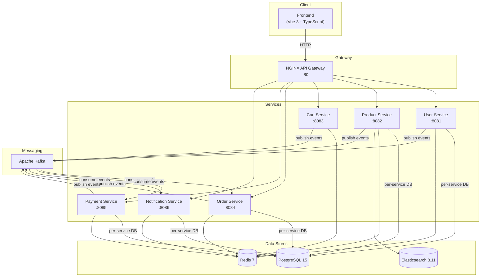

<div align="center">

# TrendyolClone

### Marketplace E-Commerce Platform

A production-grade, event-driven microservices e-commerce platform built with
**Spring Boot 3.2** and **Vue 3**, powered by **Kafka**, **Redis**, **Elasticsearch**, and **PostgreSQL**.

[](https://openjdk.org/)
[](https://spring.io/projects/spring-boot)
[](https://vuejs.org/)
[](https://www.typescriptlang.org/)
[](https://www.postgresql.org/)
[](https://redis.io/)
[](https://kafka.apache.org/)
[](https://www.elastic.co/)
[](https://docs.docker.com/compose/)

</div>

<br/>

## Architecture



> **Synchronous (REST)** -- Client requests routed through NGINX; inter-service calls between Cart, Order, and Product services.
>
> **Asynchronous (Kafka)** -- Domain events for order lifecycle, payment processing, stock updates, and notification delivery.

<br/>

## Tech Stack

| Layer | Technologies |
|:--|:--|
| **Backend** | Java 17, Spring Boot 3.2.5, Spring Security, Spring Data JPA, Gradle 8.7 |
| **Frontend** | Vue 3, TypeScript, Vite, Tailwind CSS, Pinia, Vue Router |
| **Databases** | PostgreSQL 15 (per-service isolation), Redis 7 (caching + cart storage) |
| **Search** | Elasticsearch 8.11 (full-text product search) |
| **Messaging** | Apache Kafka with Dead Letter Topics |
| **Gateway** | NGINX (reverse proxy, rate limiting, CORS) |
| **Auth** | JWT with HS256 (access + refresh token rotation) |
| **Migrations** | Flyway |
| **Docs** | SpringDoc OpenAPI / Swagger UI |
| **Infra** | Docker, Docker Compose |

<br/>

## Services

| Service | Port | Database | Key Responsibilities |
|:--|:--:|:--|:--|
| **User** | `8081` | `user_service_db` | Authentication, registration, profiles, addresses |
| **Product** | `8082` | `product_service_db` | Catalog, categories, reviews, Elasticsearch search |
| **Cart** | `8083` | Redis | Shopping cart (add, update, remove, clear) |
| **Order** | `8084` | `order_service_db` | Order creation, lifecycle, seller fulfillment |
| **Payment** | `8085` | `payment_service_db` | Payment processing, refunds, status tracking |
| **Notification** | `8086` | `notification_service_db` | Event-driven alerts (welcome, order, payment, stock) |
| **API Gateway** | `80` | -- | NGINX reverse proxy |
| **Frontend** | `3000` | -- | Vue 3 SPA |

<br/>

## Getting Started

### Prerequisites

- **Java 17** (JDK)
- **Docker Desktop** with Docker Compose
- **Node.js 18+** (for frontend development only)

### Run with Docker Compose

```bash
# Clone the repository
git clone https://github.com/ebrartaspinar/E-Commerce.git
cd E-Commerce

# Build all services and start the stack
docker compose up --build -d

# Verify everything is healthy
docker compose ps
```

Once all containers show **healthy**:

| | URL |
|:--|:--|
| Frontend | http://localhost:3000 |
| API Gateway | http://localhost:80 |
| Swagger UI (per service) | http://localhost:`{port}`/swagger-ui.html |

### Run Services Individually

```bash
# 1. Start infrastructure
docker compose up -d postgres redis kafka zookeeper elasticsearch

# 2. Build the project
./gradlew build

# 3. Run each service (separate terminals)
./gradlew :services:user-service:bootRun
./gradlew :services:product-service:bootRun
./gradlew :services:cart-service:bootRun
./gradlew :services:order-service:bootRun
./gradlew :services:payment-service:bootRun
./gradlew :services:notification-service:bootRun

# 4. Run the frontend
cd frontend && npm install && npm run dev
```

<br/>

## API Reference

All endpoints return a standard `ApiResponse` wrapper and are prefixed with `/api/v1`.

<details>
<summary><strong>Authentication</strong> &mdash; <code>/api/v1/auth</code></summary>
<br/>

| Method | Endpoint | Description | Auth |
|:--|:--|:--|:--:|
| `POST` | `/register` | Register (BUYER / SELLER / ADMIN) | -- |
| `POST` | `/login` | Login with email & password | -- |
| `POST` | `/refresh` | Refresh access token | -- |

</details>

<details>
<summary><strong>Users & Addresses</strong> &mdash; <code>/api/v1/users</code></summary>
<br/>

| Method | Endpoint | Description | Auth |
|:--|:--|:--|:--:|
| `GET` | `/me` | Current user profile | Yes |
| `PUT` | `/me` | Update profile | Yes |
| `GET` | `/{id}` | Get user by ID | Yes |
| `GET` | `/me/addresses` | List addresses | Yes |
| `POST` | `/me/addresses` | Add address | Yes |
| `PUT` | `/me/addresses/{id}` | Update address | Yes |
| `DELETE` | `/me/addresses/{id}` | Delete address | Yes |

</details>

<details>
<summary><strong>Products & Categories</strong> &mdash; <code>/api/v1/products</code></summary>
<br/>

| Method | Endpoint | Description | Auth |
|:--|:--|:--|:--:|
| `GET` | `/products` | List with filters & pagination | -- |
| `GET` | `/products/{id}` | Get by ID | -- |
| `GET` | `/products/search?q=` | Full-text search | -- |
| `GET` | `/categories` | Category tree | -- |
| `GET` | `/categories/{slug}/products` | Products by category | -- |
| `GET` | `/products/{id}/reviews` | Product reviews | -- |
| `POST` | `/products/{id}/reviews` | Create review | Yes |

</details>

<details>
<summary><strong>Seller Products</strong> &mdash; <code>/api/v1/seller/products</code></summary>
<br/>

| Method | Endpoint | Description | Auth |
|:--|:--|:--|:--:|
| `GET` | `/` | List seller's products | SELLER |
| `POST` | `/` | Create product | SELLER |
| `PUT` | `/{id}` | Update product | SELLER |
| `PATCH` | `/{id}/stock` | Update stock | SELLER |
| `DELETE` | `/{id}` | Soft-delete product | SELLER |

</details>

<details>
<summary><strong>Cart</strong> &mdash; <code>/api/v1/cart</code></summary>
<br/>

| Method | Endpoint | Description | Auth |
|:--|:--|:--|:--:|
| `GET` | `/` | Get cart | Yes |
| `POST` | `/items` | Add item | Yes |
| `PUT` | `/items/{productId}` | Update quantity | Yes |
| `DELETE` | `/items/{productId}` | Remove item | Yes |
| `DELETE` | `/` | Clear cart | Yes |
| `GET` | `/summary` | Cart summary | Yes |

</details>

<details>
<summary><strong>Orders</strong> &mdash; <code>/api/v1/orders</code></summary>
<br/>

| Method | Endpoint | Description | Auth |
|:--|:--|:--|:--:|
| `POST` | `/` | Create order | Yes |
| `GET` | `/` | List orders (paginated) | Yes |
| `GET` | `/{orderNumber}` | Get order | Yes |
| `PATCH` | `/{orderNumber}/cancel` | Cancel order | Yes |
| `GET` | `/seller/orders` | Seller's orders | SELLER |
| `PATCH` | `/seller/orders/{orderNumber}/items/{itemId}/status` | Update item status | SELLER |

</details>

<details>
<summary><strong>Payments</strong> &mdash; <code>/api/v1/payments</code></summary>
<br/>

| Method | Endpoint | Description | Auth |
|:--|:--|:--|:--:|
| `POST` | `/` | Initiate payment | Yes |
| `GET` | `/{id}` | Get by ID | Yes |
| `GET` | `/order/{orderNumber}` | Get by order number | Yes |
| `POST` | `/{id}/refund` | Refund payment | Yes |

</details>

<details>
<summary><strong>Notifications</strong> &mdash; <code>/api/v1/notifications</code></summary>
<br/>

| Method | Endpoint | Description | Auth |
|:--|:--|:--|:--:|
| `GET` | `/` | List notifications (paginated) | Yes |
| `PATCH` | `/{id}/read` | Mark as read | Yes |
| `PATCH` | `/read-all` | Mark all as read | Yes |
| `GET` | `/unread-count` | Unread count | Yes |

</details>

<br/>

## Environment Variables

| Variable | Default | Used By |
|:--|:--|:--|
| `DB_HOST` | `localhost` | All DB services |
| `DB_PORT` | `5432` | All DB services |
| `DB_USERNAME` | `postgres` | All DB services |
| `DB_PASSWORD` | `postgres` | All DB services |
| `REDIS_HOST` | `localhost` | All services |
| `REDIS_PORT` | `6379` | All services |
| `KAFKA_BOOTSTRAP_SERVERS` | `localhost:9092` | All services |
| `ELASTICSEARCH_HOST` | `localhost` | Product Service |
| `JWT_SECRET` | *(built-in)* | All services |
| `JWT_ACCESS_EXPIRATION` | `900000` (15m) | User Service |
| `JWT_REFRESH_EXPIRATION` | `604800000` (7d) | User Service |

<br/>

## Kafka Topics

| Topic | Partitions | Producers | Consumers |
|:--|:--:|:--|:--|
| `user-events` | 3 | User | Notification |
| `product-events` | 6 | Product | -- |
| `product-stock-events` | 6 | Product | Notification |
| `review-events` | 3 | Product | -- |
| `order-events` | 6 | Order | Payment, Notification |
| `payment-events` | 3 | Payment | Order, Notification |
| `cart-events` | 3 | Cart | -- |

Dead Letter Topics (`.DLT`) are configured for `user-events`, `product-events`, `order-events`, and `payment-events`.

<br/>

## Redis Caching Strategy

All services use Spring Cache with Redis and per-service key prefixes to avoid collisions.

| Service | Cache | TTL | Cached Operations |
|:--|:--|:--:|:--|
| **Product** | `products` | 30 min | getById, getByCategory |
| **Product** | `categories` | 1 hour | getCategoryTree, getBySlug |
| **Product** | `reviews` | 20 min | getProductReviews |
| **User** | `users` | 15 min | getCurrentUser, getUserById |
| **Order** | `orders` | 10 min | getOrder |
| **Order** | `order-lists` | 5 min | getOrders |
| **Notification** | `unread-count` | 2 min | getUnreadCount |
| **Payment** | `payments` | 10 min | getPayment, getByOrderNumber |

Cache eviction is triggered automatically on create, update, and delete operations.

<br/>

## Project Structure

```
E-Commerce/
├── api-gateway/                     # NGINX reverse proxy
│   ├── Dockerfile
│   └── nginx.conf
├── common-lib/                      # Shared library
│   └── src/main/java/.../common/
│       ├── config/                  # Shared configurations
│       ├── domain/                  # Base entity classes
│       ├── dto/                     # ApiResponse, PagedResponse
│       ├── event/                   # Domain event base classes
│       ├── exception/               # Global exception handling
│       └── kafka/                   # KafkaTopics constants
├── services/
│   ├── user-service/
│   ├── product-service/
│   ├── cart-service/
│   ├── order-service/
│   ├── payment-service/
│   └── notification-service/
│       └── src/main/java/.../       # Each service follows:
│           ├── api/                 #   REST controllers
│           ├── application/         #   Services & DTOs
│           ├── domain/              #   Models & repositories
│           └── infrastructure/      #   Kafka, Redis, JPA, config
├── frontend/                        # Vue 3 SPA
│   └── src/
│       ├── api/                     # Axios HTTP client
│       ├── components/              # Reusable components
│       ├── composables/             # Vue composables
│       ├── router/                  # Vue Router
│       ├── stores/                  # Pinia state management
│       ├── types/                   # TypeScript definitions
│       └── views/                   # Page components
├── scripts/
│   └── init-databases.sh            # PostgreSQL multi-DB init
├── docker-compose.yml
├── build.gradle.kts
├── settings.gradle.kts
└── gradlew
```

<br/>

## Development

```bash
# Build all services
./gradlew build

# Build a specific service
./gradlew :services:product-service:build

# Run tests
./gradlew test

# Frontend dev server (hot-reload)
cd frontend && npm run dev
```

**Swagger UI** is available per service at `http://localhost:{port}/swagger-ui.html`

**Health checks** are exposed via Spring Boot Actuator at `http://localhost:{port}/actuator/health`

<br/>

## License

This project is for educational and portfolio demonstration purposes.
