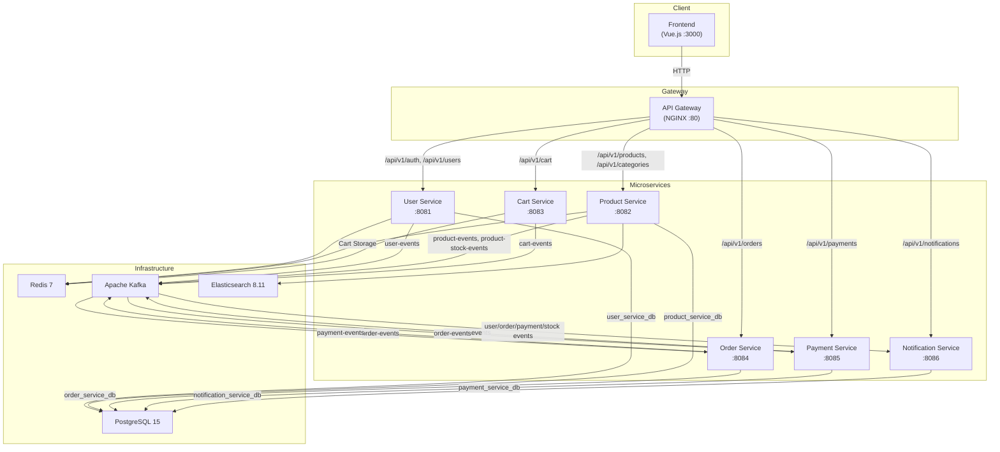

# TrendyolClone - Marketplace E-Commerce Platform

A full-stack, microservice-based marketplace e-commerce platform inspired by Trendyol. Built with Java 17/Spring Boot on the backend, Vue 3/TypeScript on the frontend, and featuring a unique **"Cozy Pixel"** RPG-inspired visual theme with the Press Start 2P font.

---

## Architecture Overview



### Communication Patterns

- **Synchronous (REST)**: Client-facing API calls routed through the NGINX gateway; inter-service calls between Cart, Order, and Product services.
- **Asynchronous (Kafka)**: Domain events for order lifecycle, payment processing, stock updates, and notification delivery.

---

## Tech Stack

| Layer | Technology |
|---|---|
| **Backend** | Java 17, Spring Boot 3.2.5, Gradle 8.7 |
| **Frontend** | Vue 3, TypeScript, Vite, Tailwind CSS, Pinia, Vue Router |
| **Databases** | PostgreSQL 15 (per-service databases), Redis 7 (caching and cart storage) |
| **Search** | Elasticsearch 8.11 |
| **Messaging** | Apache Kafka (Confluent 7.5.0) with Zookeeper |
| **API Gateway** | NGINX with rate limiting |
| **Auth** | JWT (HS256) with access/refresh token rotation |
| **Migrations** | Flyway |
| **API Docs** | SpringDoc OpenAPI (Swagger UI) |
| **Containerization** | Docker, Docker Compose |
| **Design Theme** | "Cozy Pixel" RPG-inspired UI with Press Start 2P font |

---

## Services Overview

| Service | Port | Database | Storage | Description |
|---|---|---|---|---|
| **User Service** | 8081 | `user_service_db` (PostgreSQL) | Redis (token blacklist) | Authentication, registration, user profiles, address management |
| **Product Service** | 8082 | `product_service_db` (PostgreSQL) | Redis (cache), Elasticsearch | Product catalog, categories, reviews, seller product management |
| **Cart Service** | 8083 | -- | Redis (primary store) | Shopping cart operations (add, update, remove, clear) |
| **Order Service** | 8084 | `order_service_db` (PostgreSQL) | -- | Order creation, lifecycle management, seller order fulfillment |
| **Payment Service** | 8085 | `payment_service_db` (PostgreSQL) | -- | Payment processing, refunds, payment status tracking |
| **Notification Service** | 8086 | `notification_service_db` (PostgreSQL) | -- | Event-driven notifications (welcome, order, payment, stock alerts) |
| **API Gateway** | 80 | -- | -- | NGINX reverse proxy with rate limiting and CORS |
| **Frontend** | 3000 | -- | -- | Vue 3 SPA with Tailwind CSS pixel-art theme |

---

## Quick Start

### Prerequisites

- **Java 17** (JDK)
- **Docker Desktop** (with Docker Compose)
- **Node.js 18+** and npm (for frontend development)

### Option 1: Run Everything with Docker Compose

```bash
# Clone the repository
git clone <repository-url>
cd trendyol-clone

# Build and start all services + infrastructure
docker-compose up --build -d

# Verify all services are running
docker-compose ps
```

The application will be available at:
- **Frontend**: http://localhost:3000
- **API Gateway**: http://localhost:80
- **Swagger UI** (per service): http://localhost:808X/swagger-ui.html

### Option 2: Run Infrastructure + Services Individually

```bash
cd trendyol-clone

# 1. Start infrastructure only (Postgres, Redis, Kafka, Elasticsearch)
docker-compose -f docker-compose.infra.yml up -d

# 2. Wait for infrastructure to become healthy
docker-compose -f docker-compose.infra.yml ps

# 3. Build the entire project
./gradlew build

# 4. Run individual services (each in a separate terminal)
./gradlew :services:user-service:bootRun
./gradlew :services:product-service:bootRun
./gradlew :services:cart-service:bootRun
./gradlew :services:order-service:bootRun
./gradlew :services:payment-service:bootRun
./gradlew :services:notification-service:bootRun

# 5. Run the frontend
cd frontend
npm install
npm run dev
```

### Environment Variables

Each service can be configured via environment variables:

| Variable | Default | Description |
|---|---|---|
| `DB_HOST` | `localhost` | PostgreSQL hostname |
| `DB_PORT` | `5432` | PostgreSQL port |
| `DB_USERNAME` | `postgres` | Database username |
| `DB_PASSWORD` | `postgres` | Database password |
| `REDIS_HOST` | `localhost` | Redis hostname |
| `REDIS_PORT` | `6379` | Redis port |
| `KAFKA_BOOTSTRAP_SERVERS` | `localhost:9092` | Kafka broker address |
| `ELASTICSEARCH_HOST` | `localhost` | Elasticsearch hostname (product-service only) |
| `ELASTICSEARCH_PORT` | `9200` | Elasticsearch port (product-service only) |
| `JWT_SECRET` | *(built-in default)* | JWT signing key (min 256 bits for HS256) |
| `JWT_ACCESS_EXPIRATION` | `900000` | Access token TTL in ms (15 minutes) |
| `JWT_REFRESH_EXPIRATION` | `604800000` | Refresh token TTL in ms (7 days) |
| `PRODUCT_SERVICE_URL` | `http://localhost:8082` | Product service URL (used by cart-service and order-service) |
| `CART_SERVICE_URL` | `http://localhost:8083` | Cart service URL (used by order-service) |

---

## API Endpoints

All API endpoints are prefixed with `/api/v1` and return a standard `ApiResponse` wrapper.

### Authentication (User Service -- :8081)

| Method | Path | Description | Auth |
|---|---|---|---|
| `POST` | `/api/v1/auth/register` | Register a new user (BUYER, SELLER, or ADMIN) | No |
| `POST` | `/api/v1/auth/login` | Login with email and password | No |
| `POST` | `/api/v1/auth/refresh` | Refresh access token | No |

### Users (User Service -- :8081)

| Method | Path | Description | Auth |
|---|---|---|---|
| `GET` | `/api/v1/users/me` | Get current user profile | Yes |
| `PUT` | `/api/v1/users/me` | Update current user profile | Yes |
| `GET` | `/api/v1/users/{id}` | Get user by ID (internal) | Yes |

### Addresses (User Service -- :8081)

| Method | Path | Description | Auth |
|---|---|---|---|
| `GET` | `/api/v1/users/me/addresses` | List user addresses | Yes |
| `POST` | `/api/v1/users/me/addresses` | Add a new address | Yes |
| `PUT` | `/api/v1/users/me/addresses/{id}` | Update an address | Yes |
| `DELETE` | `/api/v1/users/me/addresses/{id}` | Delete an address | Yes |

### Products (Product Service -- :8082)

| Method | Path | Description | Auth |
|---|---|---|---|
| `GET` | `/api/v1/products` | List products with filters and pagination | No |
| `GET` | `/api/v1/products/{id}` | Get product by ID | No |
| `GET` | `/api/v1/products/search?q=` | Search products (Elasticsearch) | No |

### Categories (Product Service -- :8082)

| Method | Path | Description | Auth |
|---|---|---|---|
| `GET` | `/api/v1/categories` | Get category tree | No |
| `GET` | `/api/v1/categories/{slug}/products` | Get products by category slug | No |

### Reviews (Product Service -- :8082)

| Method | Path | Description | Auth |
|---|---|---|---|
| `GET` | `/api/v1/products/{productId}/reviews` | Get product reviews | No |
| `POST` | `/api/v1/products/{productId}/reviews` | Create a review | Yes |

### Seller Products (Product Service -- :8082)

| Method | Path | Description | Auth |
|---|---|---|---|
| `GET` | `/api/v1/seller/products` | List seller's products | Yes (SELLER) |
| `POST` | `/api/v1/seller/products` | Create a new product | Yes (SELLER) |
| `PUT` | `/api/v1/seller/products/{id}` | Update a product | Yes (SELLER) |
| `PATCH` | `/api/v1/seller/products/{id}/stock` | Update stock quantity | Yes (SELLER) |
| `DELETE` | `/api/v1/seller/products/{id}` | Soft-delete a product | Yes (SELLER) |

### Cart (Cart Service -- :8083)

| Method | Path | Description | Auth |
|---|---|---|---|
| `GET` | `/api/v1/cart` | Get current user's cart | Yes |
| `POST` | `/api/v1/cart/items` | Add item to cart | Yes |
| `PUT` | `/api/v1/cart/items/{productId}` | Update item quantity | Yes |
| `DELETE` | `/api/v1/cart/items/{productId}` | Remove item from cart | Yes |
| `DELETE` | `/api/v1/cart` | Clear entire cart | Yes |
| `GET` | `/api/v1/cart/summary` | Get cart summary | Yes |

### Orders (Order Service -- :8084)

| Method | Path | Description | Auth |
|---|---|---|---|
| `POST` | `/api/v1/orders` | Create a new order | Yes |
| `GET` | `/api/v1/orders` | List user's orders (paginated) | Yes |
| `GET` | `/api/v1/orders/{orderNumber}` | Get order by order number | Yes |
| `PATCH` | `/api/v1/orders/{orderNumber}/cancel` | Cancel an order | Yes |

### Seller Orders (Order Service -- :8084)

| Method | Path | Description | Auth |
|---|---|---|---|
| `GET` | `/api/v1/seller/orders` | List seller's orders | Yes (SELLER) |
| `PATCH` | `/api/v1/seller/orders/{orderNumber}/items/{itemId}/status` | Update order item status | Yes (SELLER) |

### Payments (Payment Service -- :8085)

| Method | Path | Description | Auth |
|---|---|---|---|
| `POST` | `/api/v1/payments` | Initiate a payment | Yes |
| `GET` | `/api/v1/payments/{id}` | Get payment by ID | Yes |
| `GET` | `/api/v1/payments/order/{orderNumber}` | Get payment by order number | Yes |
| `POST` | `/api/v1/payments/{id}/refund` | Refund a payment | Yes |

### Notifications (Notification Service -- :8086)

| Method | Path | Description | Auth |
|---|---|---|---|
| `GET` | `/api/v1/notifications` | List user notifications (paginated) | Yes |
| `PATCH` | `/api/v1/notifications/{id}/read` | Mark notification as read | Yes |
| `PATCH` | `/api/v1/notifications/read-all` | Mark all as read | Yes |
| `GET` | `/api/v1/notifications/unread-count` | Get unread count | Yes |

---

## Development

### Building the Backend

```bash
# Build all services
./gradlew build

# Build a specific service
./gradlew :services:product-service:build

# Run tests
./gradlew test

# Clean build
./gradlew clean build
```

### Frontend Development

```bash
cd frontend

# Install dependencies
npm install

# Start dev server (hot-reload)
npm run dev

# Type-check and build for production
npm run build

# Preview production build
npm run preview
```

### Swagger UI

Each service exposes interactive API documentation:

- User Service: http://localhost:8081/swagger-ui.html
- Product Service: http://localhost:8082/swagger-ui.html
- Cart Service: http://localhost:8083/swagger-ui.html
- Order Service: http://localhost:8084/swagger-ui.html
- Payment Service: http://localhost:8085/swagger-ui.html
- Notification Service: http://localhost:8086/swagger-ui.html

### Health Checks

All services expose Spring Boot Actuator endpoints:

```
GET http://localhost:808X/actuator/health
GET http://localhost:808X/actuator/info
GET http://localhost:808X/actuator/metrics
```

---

## Project Structure

```
trendyol-clone/
├── api-gateway/                    # NGINX reverse proxy
│   ├── Dockerfile
│   └── nginx.conf
├── common-lib/                     # Shared library across all services
│   └── src/main/java/.../common/
│       ├── config/                 # Shared configurations
│       ├── domain/                 # Base entity classes
│       ├── dto/                    # ApiResponse, PagedResponse
│       ├── event/                  # Domain event base classes
│       ├── exception/              # Common exception types
│       └── kafka/                  # KafkaTopics constants
├── services/
│   ├── user-service/               # Auth, users, addresses
│   ├── product-service/            # Products, categories, reviews, search
│   ├── cart-service/               # Redis-backed shopping cart
│   ├── order-service/              # Order lifecycle, seller fulfillment
│   ├── payment-service/            # Payment processing, refunds
│   └── notification-service/       # Event-driven notifications
│       └── src/main/java/.../
│           ├── api/                # REST controllers
│           │   └── controller/
│           ├── application/        # Application services, DTOs
│           │   ├── dto/
│           │   └── service/
│           ├── domain/             # Domain models, repositories
│           │   ├── model/
│           │   └── repository/
│           └── infrastructure/     # Kafka, Redis, JPA implementations
│               ├── kafka/
│               ├── persistence/
│               └── config/
├── frontend/                       # Vue 3 SPA
│   ├── src/
│   │   ├── api/                    # Axios HTTP client
│   │   ├── assets/                 # Static assets
│   │   ├── components/             # Reusable Vue components
│   │   ├── composables/            # Vue composables
│   │   ├── router/                 # Vue Router configuration
│   │   ├── stores/                 # Pinia state stores
│   │   │   ├── auth.ts
│   │   │   ├── cart.ts
│   │   │   ├── notification.ts
│   │   │   ├── order.ts
│   │   │   ├── product.ts
│   │   │   └── seller.ts
│   │   ├── types/                  # TypeScript type definitions
│   │   └── views/                  # Page-level components
│   ├── package.json
│   └── vite.config.ts
├── scripts/
│   └── init-databases.sh           # PostgreSQL multi-DB init script
├── docs/                           # Project documentation
│   ├── ARCHITECTURE.md
│   └── API.md
├── docker-compose.yml              # Full-stack Docker Compose
├── docker-compose.infra.yml        # Infrastructure-only Docker Compose
├── build.gradle.kts                # Root Gradle build
├── settings.gradle.kts             # Gradle multi-project settings
└── gradlew / gradlew.bat           # Gradle wrapper
```

---

## Kafka Topics

| Topic | Partitions | Producers | Consumers |
|---|---|---|---|
| `user-events` | 3 | User Service | Notification Service |
| `product-events` | 6 | Product Service | -- |
| `product-stock-events` | 6 | Product Service | Notification Service |
| `review-events` | 3 | Product Service | -- |
| `order-events` | 6 | Order Service | Payment Service, Notification Service |
| `payment-events` | 3 | Payment Service | Order Service, Notification Service |
| `cart-events` | 3 | Cart Service | -- |

Dead Letter Topics (DLT) are configured for `user-events`, `product-events`, `order-events`, and `payment-events`.

---

## License

This project is for educational and portfolio demonstration purposes.
