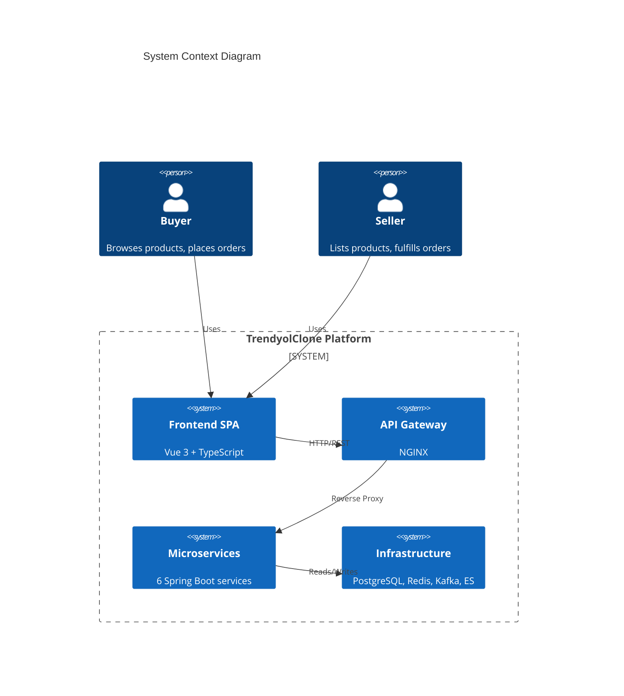
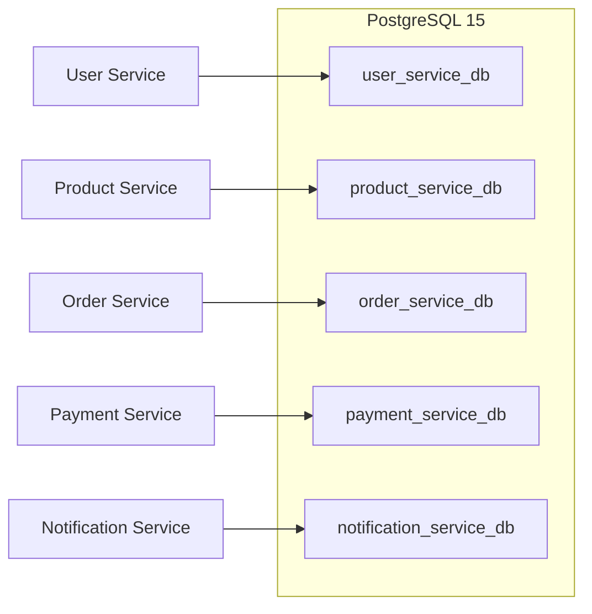
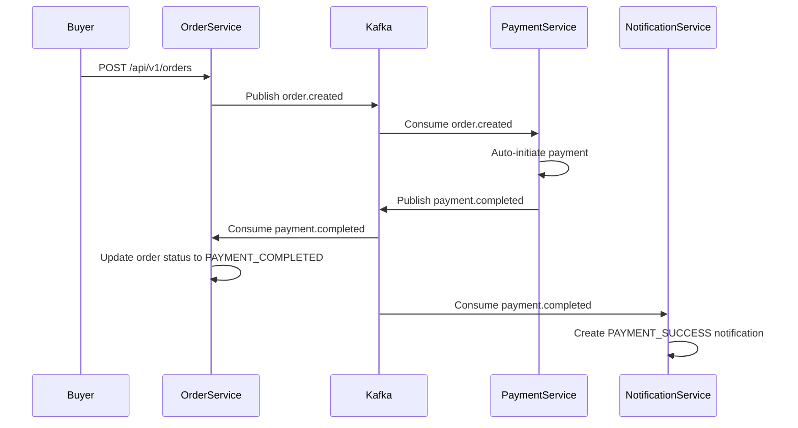
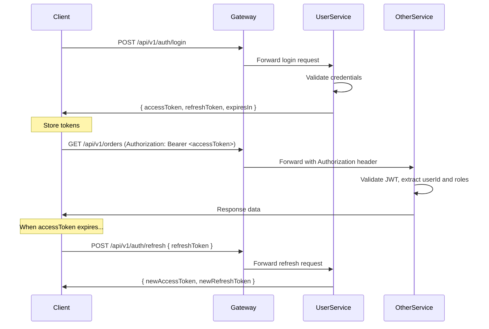
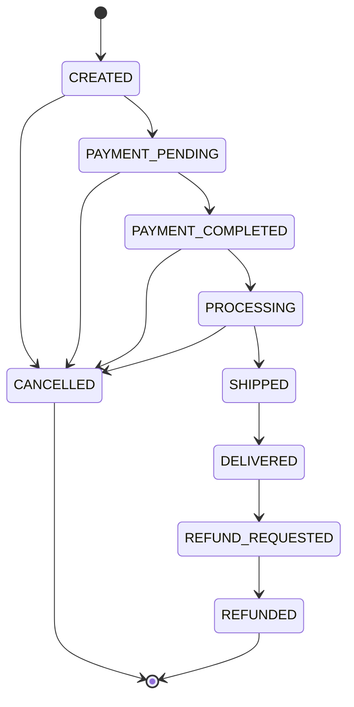
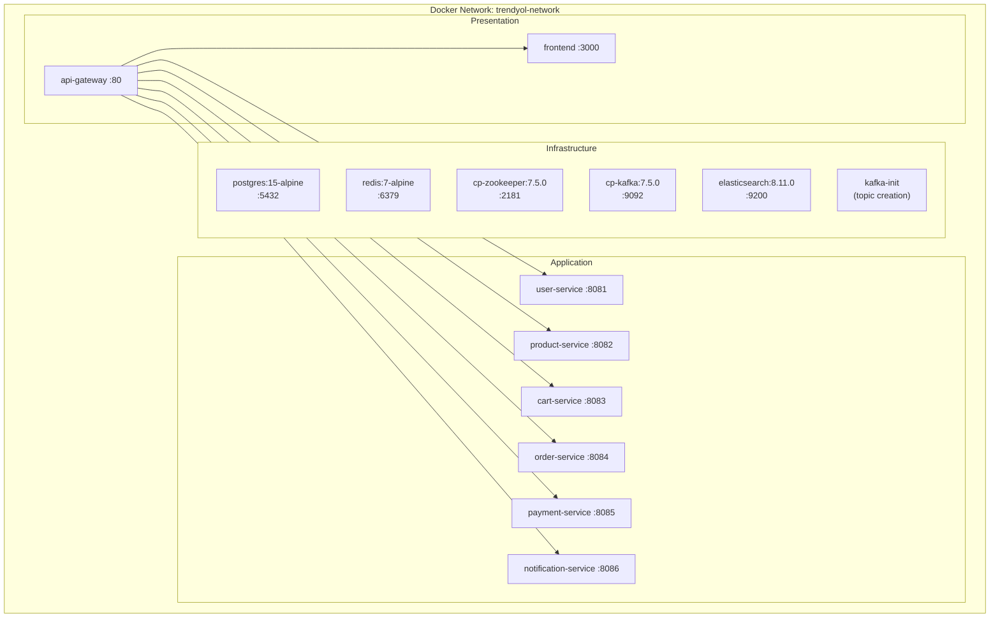

# Architecture Documentation

This document describes the system design, architecture decisions, and communication patterns of the TrendyolClone marketplace platform.

---

## Table of Contents

1. [System Overview](#system-overview)
2. [Architectural Style](#architectural-style)
3. [Service Architecture (DDD Layered)](#service-architecture-ddd-layered)
4. [Database per Service](#database-per-service)
5. [Event-Driven Communication](#event-driven-communication)
6. [Authentication and Authorization](#authentication-and-authorization)
7. [API Gateway](#api-gateway)
8. [Redis Usage](#redis-usage)
9. [Elasticsearch Integration](#elasticsearch-integration)
10. [Order State Machine](#order-state-machine)
11. [Frontend Architecture](#frontend-architecture)
12. [Deployment Architecture](#deployment-architecture)

---

## System Overview

TrendyolClone is a **marketplace** platform where multiple sellers can list products and buyers can browse, search, add items to a cart, place orders, and receive notifications. The platform is decomposed into six domain-driven microservices, an NGINX API gateway, and a Vue 3 single-page application.



---

## Architectural Style

The platform follows a **microservices architecture** with these key design principles:

- **Domain-Driven Design (DDD)**: Each service represents a bounded context with its own domain model.
- **Database per Service**: Each service owns its database, ensuring loose coupling at the data layer.
- **Event-Driven Architecture**: Services communicate asynchronously via Apache Kafka domain events.
- **API Gateway Pattern**: NGINX acts as a single entry point, handling routing, rate limiting, and CORS.
- **Shared Nothing**: Services do not share databases or runtime state. The only shared artifact is `common-lib`, a compile-time library with DTOs, base classes, and Kafka topic constants.

---

## Service Architecture (DDD Layered)

Each microservice follows a **four-layer DDD architecture**:

```
service/
└── src/main/java/com/trendyolclone/{service}/
    ├── api/                    # Interface Adapters (inbound)
    │   └── controller/         # REST controllers
    ├── application/            # Application Layer
    │   ├── dto/                # Request/Response DTOs
    │   └── service/            # Application services (use cases)
    ├── domain/                 # Domain Layer (core business logic)
    │   ├── model/              # Entities, Value Objects, Enums
    │   └── repository/         # Repository interfaces (ports)
    └── infrastructure/         # Infrastructure Layer (outbound adapters)
        ├── config/             # Spring configuration classes
        ├── kafka/              # Kafka producers and consumers
        └── persistence/        # JPA repository implementations
```

### Layer Responsibilities

| Layer | Responsibility | Dependencies |
|---|---|---|
| **API** | HTTP request handling, input validation, response mapping | Application |
| **Application** | Orchestration of use cases, DTO transformations, transaction management | Domain |
| **Domain** | Core business rules, entities, value objects, domain events | None (pure Java) |
| **Infrastructure** | Database access, Kafka messaging, Redis caching, external HTTP calls | Application, Domain |

### Dependency Rule

Dependencies flow inward: `API -> Application -> Domain`. The Infrastructure layer implements interfaces (ports) defined in the Domain layer, following the **Dependency Inversion Principle**.

---

## Database per Service

Each service owns a dedicated PostgreSQL database, created at startup by `scripts/init-databases.sh`:



**Key decisions:**

- **Flyway** manages schema migrations per service (`src/main/resources/db/migration/`).
- JPA/Hibernate is set to `ddl-auto: validate` in production, ensuring the schema matches entity definitions without auto-altering tables.
- **Cart Service** has no relational database. It stores carts exclusively in Redis, which makes it stateless from a SQL perspective.
- Connection pooling is managed by HikariCP with a maximum of 10 connections per service.

---

## Event-Driven Communication

Services communicate asynchronously through **Apache Kafka domain events**. Each event carries an `eventType` string and a `payload` JSON object.

### Event Flow Diagram



### Topic Catalog

| Topic | Event Types | Description |
|---|---|---|
| `user-events` | `USER_REGISTERED`, `user.registered` | Emitted on new user registration |
| `product-events` | `product.created`, `product.updated`, `product.deleted` | Product lifecycle events |
| `product-stock-events` | `product.stock.low`, `product.stock.updated` | Stock level changes |
| `review-events` | `review.created` | New product review submitted |
| `order-events` | `order.created`, `order.shipped`, `order.delivered`, `order.cancelled` | Order lifecycle transitions |
| `payment-events` | `PAYMENT_COMPLETED`, `PAYMENT_FAILED`, `payment.completed`, `payment.failed` | Payment outcome events |
| `cart-events` | `cart.item.added`, `cart.item.removed`, `cart.cleared` | Cart activity events |

### Consumer Groups

| Service | Group ID | Topics Consumed |
|---|---|---|
| Order Service | `order-service-group` | `payment-events` |
| Payment Service | `payment-service-group` | `order-events` |
| Notification Service | `notification-service-group` | `user-events`, `order-events`, `payment-events`, `product-stock-events` |

### Dead Letter Topics

Failed messages are routed to Dead Letter Topics (DLT) to prevent consumer loops:

- `user-events.DLT`
- `product-events.DLT`
- `order-events.DLT`
- `payment-events.DLT`

---

## Authentication and Authorization

### JWT Authentication Flow



### Token Configuration

| Parameter | Default Value | Description |
|---|---|---|
| Algorithm | HS256 | HMAC-SHA256 signing |
| Access Token TTL | 900,000 ms (15 min) | Short-lived for security |
| Refresh Token TTL | 604,800,000 ms (7 days) | Long-lived for UX |
| Signing Key | Shared secret (env variable) | Symmetric key shared across services |

### Role-Based Access Control

The system supports three roles, stored in the JWT claims:

| Role | Capabilities |
|---|---|
| `BUYER` | Browse products, manage cart, place orders, write reviews, manage addresses |
| `SELLER` | All BUYER capabilities + create/update/delete products, manage order fulfillment |
| `ADMIN` | Full system access |

Seller-specific endpoints (`/api/v1/seller/*`) are protected with `@PreAuthorize("hasRole('SELLER')")`.

### Token Blacklisting

Redis is used by the User Service to maintain a blacklist of revoked tokens, ensuring immediate invalidation upon logout or security events.

---

## API Gateway

The NGINX API gateway (`api-gateway/nginx.conf`) provides:

### Routing

All `/api/v1/*` paths are routed to the appropriate upstream service. The frontend SPA is served as a catch-all at `/`.

### Rate Limiting

Two rate limit zones are configured:

| Zone | Rate | Burst | Applied To |
|---|---|---|---|
| `auth` | 5 requests/minute | 10 | `/api/v1/auth/*` (login, register, refresh) |
| `api` | 100 requests/second | 20 | All other `/api/v1/*` endpoints |

### CORS

Global CORS headers are injected for all responses:

- `Access-Control-Allow-Origin: *`
- `Access-Control-Allow-Methods: GET, POST, PUT, PATCH, DELETE, OPTIONS`
- `Access-Control-Allow-Headers: Authorization, Content-Type, X-Correlation-Id`

Preflight `OPTIONS` requests return `204 No Content`.

### Request Tracing

The `X-Correlation-Id` header is forwarded through all proxy layers, and each service logs it using MDC for distributed tracing:

```
%d{yyyy-MM-dd HH:mm:ss.SSS} [%thread] [%X{correlationId}] %-5level %logger{36} - %msg%n
```

---

## Redis Usage

Redis 7 serves three distinct purposes across the platform:

### 1. Cart Storage (Cart Service)

The Cart Service uses Redis as its **primary datastore** rather than a relational database. Carts are serialized as JSON and keyed by `userId`. This provides:

- Sub-millisecond read/write latency
- Automatic expiration of abandoned carts
- No need for schema migrations
- Horizontal scalability

### 2. Product Caching (Product Service)

Frequently accessed product data and category trees are cached in Redis to reduce database load. Cache entries are invalidated when products are updated or deleted.

### 3. Token Blacklisting (User Service)

When a user logs out or a token is revoked, the token ID is added to a Redis set with a TTL matching the token's remaining lifetime. Every authenticated request checks this blacklist before granting access.

### Configuration

Redis is configured with:

- **Max memory**: 256 MB
- **Eviction policy**: `allkeys-lru` (Least Recently Used)

---

## Elasticsearch Integration

The Product Service integrates with **Elasticsearch 8.11** for full-text search capabilities.

### Search Features

- **Full-text search**: Product name, description, and brand fields are indexed and searchable via the `GET /api/v1/products/search?q=` endpoint.
- **Filtered search**: Combine text search with category, brand, and price range filters.
- **Pagination**: Standard Spring Data pageable parameters (`page`, `size`, `sort`).

### Indexing Strategy

Products are indexed into Elasticsearch when created or updated via the Product Service. The Elasticsearch index mirrors the key fields of the `products` database table.

```
Security: xpack.security.enabled=false (development mode)
Discovery: single-node mode
JVM Heap: 512 MB
```

---

## Order State Machine

Orders follow a strict state machine with validated transitions. Invalid transitions are rejected at the domain layer.



### Order Status Descriptions

| Status | Description |
|---|---|
| `CREATED` | Order has been placed by the buyer |
| `PAYMENT_PENDING` | Awaiting payment processing |
| `PAYMENT_COMPLETED` | Payment confirmed successfully |
| `PROCESSING` | Seller is preparing the order |
| `SHIPPED` | Order has been handed to the carrier |
| `DELIVERED` | Order delivered to the buyer |
| `CANCELLED` | Order cancelled (by buyer or system) |
| `REFUND_REQUESTED` | Buyer requested a refund after delivery |
| `REFUNDED` | Refund has been processed |

### Order Item Status

Individual items within an order have their own status, managed by sellers:

`PENDING` -> `CONFIRMED` -> `SHIPPED` -> `DELIVERED`

Items can also be `CANCELLED` from any pre-delivery state.

### Payment Integration

The order-payment lifecycle is fully event-driven:

1. **Order Created**: `order.created` event is published to Kafka.
2. **Payment Auto-Initiated**: Payment Service consumes the event and initiates payment processing.
3. **Payment Result**: A `payment.completed` or `payment.failed` event is published.
4. **Order Updated**: Order Service consumes the payment event and transitions the order status.
5. **Notification Sent**: Notification Service consumes both order and payment events to alert the user.

---

## Frontend Architecture

The frontend is a **Vue 3 Single-Page Application** built with TypeScript and Vite.

### Technology Stack

| Library | Purpose |
|---|---|
| Vue 3 (Composition API) | UI framework |
| TypeScript | Type safety |
| Vite | Build tool and dev server |
| Tailwind CSS | Utility-first styling |
| Pinia | State management |
| Vue Router | Client-side routing |
| Axios | HTTP client |

### State Management (Pinia Stores)

| Store | Responsibilities |
|---|---|
| `auth` | Login/register state, JWT token management, current user |
| `cart` | Cart items, totals, add/remove/update operations |
| `product` | Product listing, filtering, search results |
| `order` | Order history, order details, order creation |
| `notification` | Notification list, unread count, mark-as-read |
| `seller` | Seller product management, seller order management |

### Page Views

| View | Route | Description |
|---|---|---|
| `HomeView` | `/` | Landing page with featured products |
| `ProductListView` | `/products` | Browsable product catalog with filters |
| `ProductDetailView` | `/products/:id` | Individual product page with reviews |
| `SearchResultsView` | `/search` | Search results page |
| `CartView` | `/cart` | Shopping cart |
| `CheckoutView` | `/checkout` | Order placement |
| `OrderHistoryView` | `/orders` | User order history |
| `OrderDetailView` | `/orders/:orderNumber` | Individual order details |
| `ProfileView` | `/profile` | User profile and address management |
| `LoginView` | `/login` | Login form |
| `RegisterView` | `/register` | Registration form |
| `SellerDashboard` | `/seller` | Seller overview dashboard |
| `SellerProducts` | `/seller/products` | Seller product management |
| `SellerProductForm` | `/seller/products/new` | Create/edit product form |
| `SellerOrders` | `/seller/orders` | Seller order fulfillment |

### Design Theme

The UI follows a **"Cozy Pixel"** RPG-inspired design language:

- **Font**: Press Start 2P (Google Fonts)
- **Style**: Pixel-art inspired borders, retro color palette, card-based layouts
- **Responsive**: Tailwind CSS breakpoints for mobile, tablet, and desktop

---

## Deployment Architecture

### Docker Compose (Full Stack)

The `docker-compose.yml` file defines the complete deployment:



### Health Checks

Every container defines health checks:

- **PostgreSQL**: `pg_isready`
- **Redis**: `redis-cli ping`
- **Kafka**: `kafka-broker-api-versions`
- **Elasticsearch**: `curl /_cluster/health`
- **Application Services**: `curl /actuator/health`

Services start only after their dependencies are healthy (using `condition: service_healthy`).

### Service Restart Policy

All application services are configured with `restart: on-failure` for automatic recovery from transient errors.

### Infrastructure-Only Mode

For local development, `docker-compose.infra.yml` starts only the infrastructure components (PostgreSQL, Redis, Kafka, Zookeeper, Elasticsearch, and Kafka topic initialization), allowing you to run services from your IDE.
